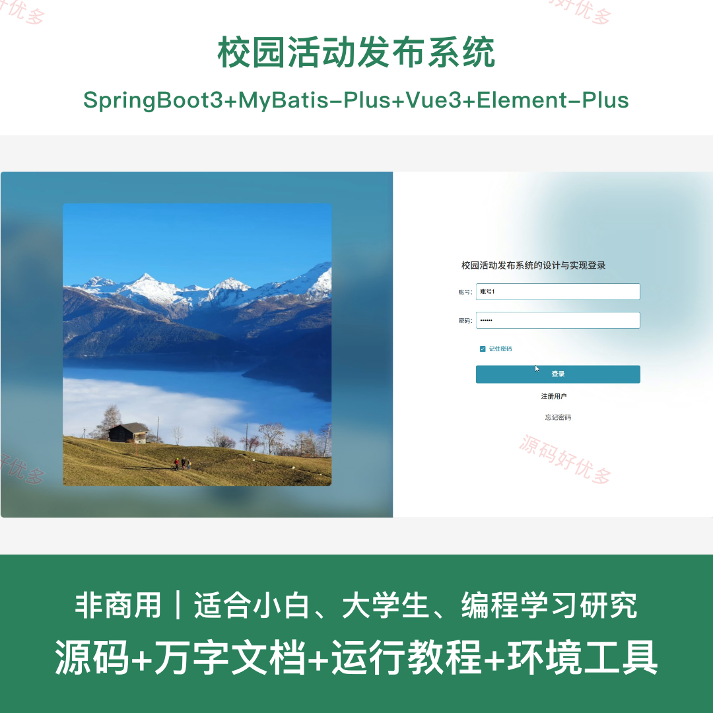
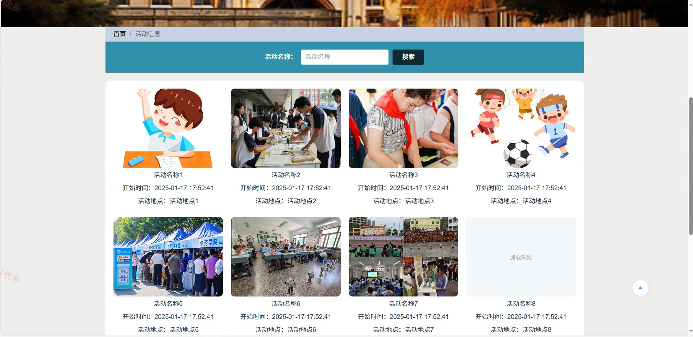
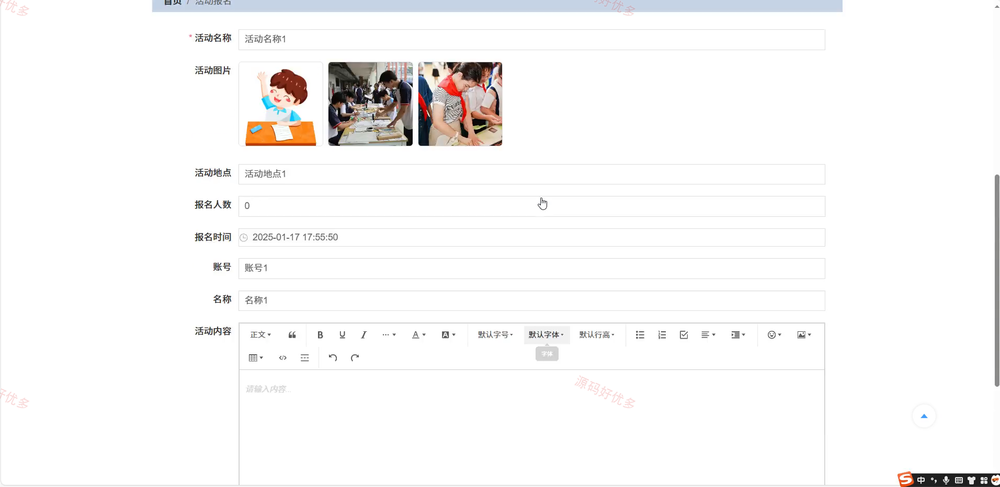
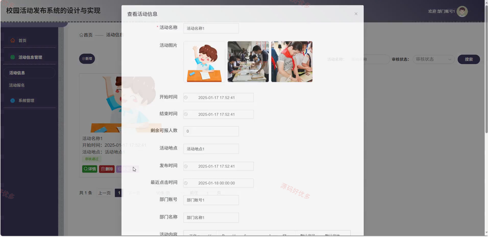
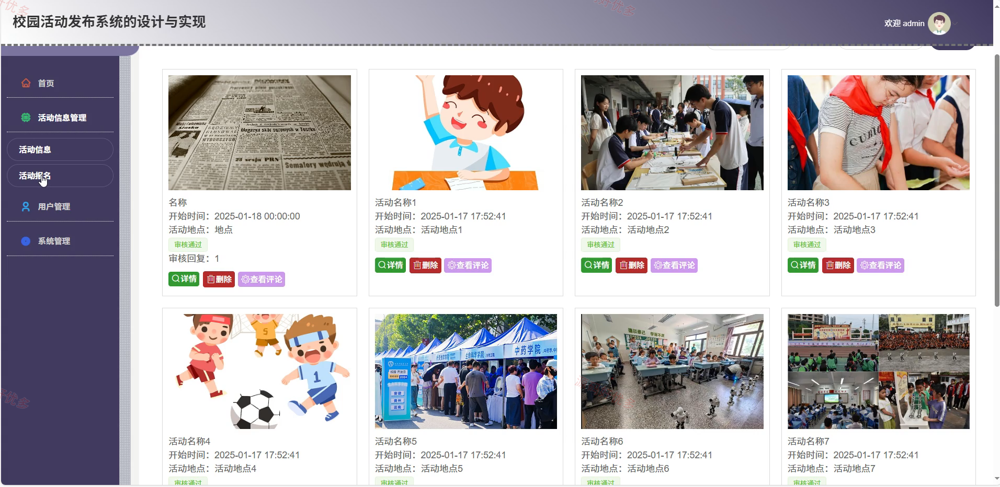
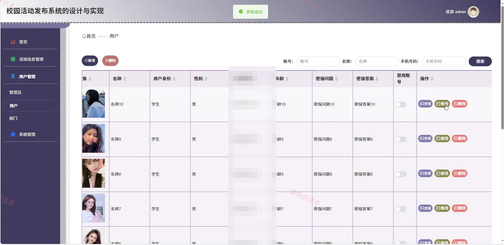
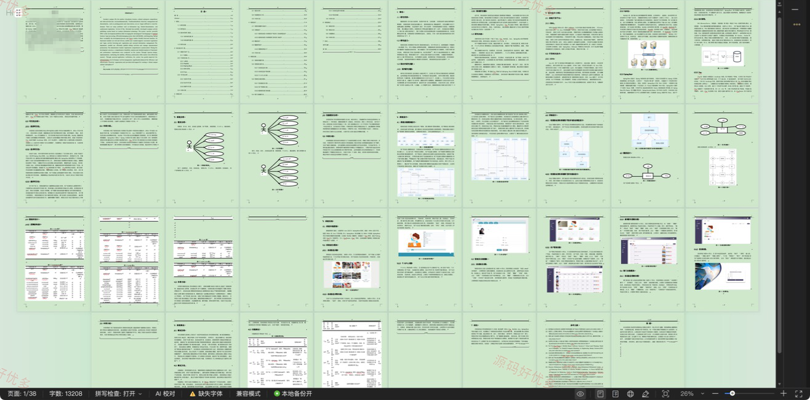

## 源码问题查看主页咨询

### 一、关键词
校园活动发布系统、校园活动发布、校园活动发布信息管理、校园活动发布后台管理

### 二、作品包含
源码+数据库+万字设计文档+全套环境和工具资源+本地部署教程

### 三、项目技术
前端技术： Html、Css、Js、Vue3.2、Element-Plus
后端技术：Java、SpringBoot3.3.0、MyBatis-Plus

### 四、运行环境（以下版本亲测，其他版本兼容性请自行测试）
开发工具：IDEA/eclipse + VSCODE

数据库：MySQL8.0+（共11张表）

数据库管理工具：Navicat10以上版本

环境配置软件： JDK17 + Maven3.6.3

前端Nodejs：16+

浏览器：谷歌浏览器

### 五、项目介绍
项目编号：springbootA575D

校园活动发布系统面向管理员、用户、部门，提供活动信息管理、系统管理、活动信息查看、活动信息查看评论、活动信息报名、活动信息首页总数、活动报名查看等功能，实现各角色在系统中的实际业务协作。

角色：管理员、用户、部门

管理员功能：后台登录、活动信息管理、用户管理、系统管理。

用户功能：前台登录、前台注册、活动信息查看、活动信息查看评论、活动信息报名。

部门功能：后台登录、活动信息管理、活动信息查看评论、活动信息首页总数、活动报名查看、活动报名首页总数、系统公告查看。

### 六、运行截图

